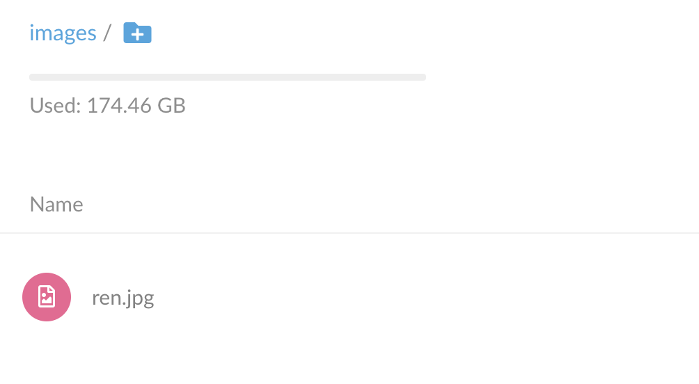
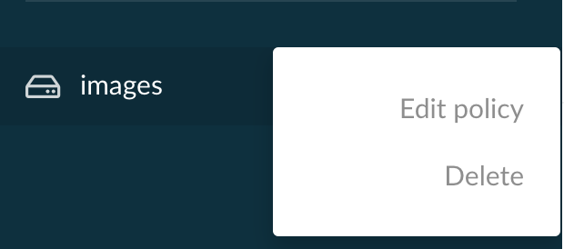
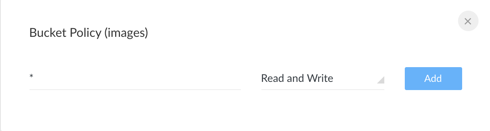

# image-resizer
画像リサイズサーバー構築

# 使い方

```sh
docker-compose up -d

# open http://localhost:9000/
# Access Key: miniominio
# Secert Key: miniominio
```

## Upload image -> images/[target image]



## Edit policy



Prefix: *  
Read and Write


## Access to image

```
http://localhost:8080/image/[target image]

ex.)
http://localhost:8080/image/ren.jpg
```

## Resize

```
http://localhost:8080/resize/[width]x[height]/[target image]

ex.)
http://localhost:8080/resize/500x500/ren.jpg
```

